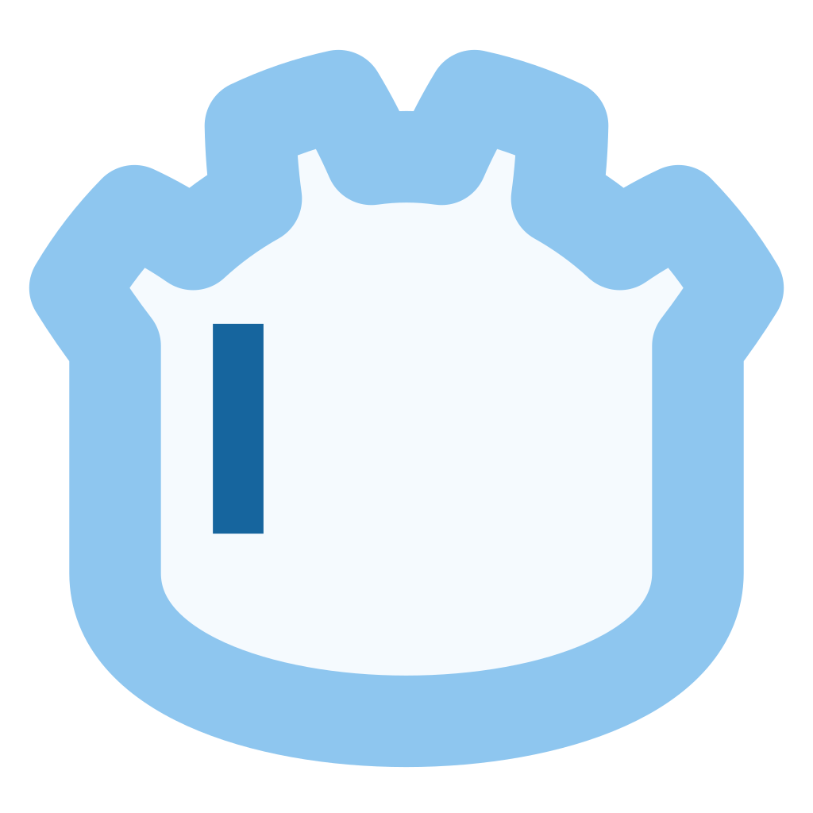
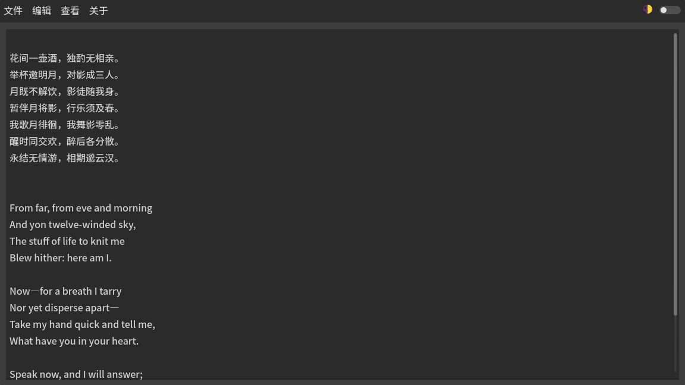

# GotePad

## 简介 Overview

GotePad是一款用 Godot 引擎开发的文本编辑器。

本项目是 GoteEdit 使用范例。

GotePad is a text editor developed with the Godot engine.

This project serves as an example of using GoteEdit.

## 截图 Screenshots

## 授权协议 License

本项目以 MIT 协议发布。

第三方资源：

> Godot Engine
>     from https://godotengine.org/
>     under the MIT license
> Noto Sans
>     from https://fonts.google.com/noto
>     under the OFL license

This project is licensed under the MIT license.

Third-party resources:

> Godot Engine
>     from https://godotengine.org/
>     under the MIT license
> Noto Sans
>     from https://fonts.google.com/noto
>     under the OFL license

